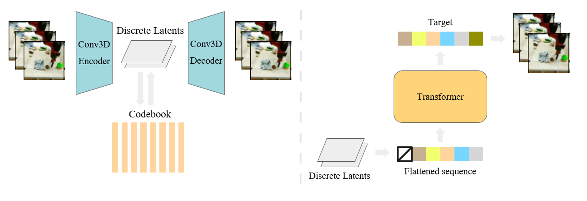

# VideoGPT: Video Generation using VQ-VAE and Transformers

[[Paper]](https://arxiv.org/abs/2104.10157)[[Website]](https://wilson1yan.github.io/videogpt/index.html)[[Colab]](https://colab.research.google.com/github/wilson1yan/VideoGPT/blob/master/notebooks/Using_VideoGPT.ipynb)
Integrated to [Huggingface Spaces](https://huggingface.co/spaces) with [Gradio](https://github.com/gradio-app/gradio). See demo: [](https://huggingface.co/spaces/akhaliq/VideoGPT)

We present VideoGPT: a conceptually simple architecture for scaling likelihood based generative modeling to natural videos. VideoGPT uses VQ-VAE that learns downsampled discrete latent representations of a raw video by employing 3D convolutions and axial self-attention. A simple GPT-like architecture is then used to autoregressively model the discrete latents using spatio-temporal position encodings. Despite the simplicity in formulation and ease of training, our architecture is able to generate samples competitive with state-of-the-art GAN models for video generation on the BAIR Robot dataset, and generate high fidelity natural images from UCF-101 and Tumbler GIF Dataset (TGIF). We hope our proposed architecture serves as a reproducible reference for a minimalistic implementation of transformer based video generation models.


## Approach


## Installation
Change the `cudatoolkit` version compatible to your machine.
```bash
conda install --yes -c conda-forge cudatoolkit=11.0 cudnn
pip install torch==1.7.1+cu110 torchvision==0.8.2+cu110 torchaudio==0.7.2 -f https://download.pytorch.org/whl/torch_stable.html
pip install git+https://github.com/wilson1yan/VideoGPT.git
```

### Sparse Attention (Optional)
For limited compute scenarios, it may be beneficial to use [sparse attention](https://arxiv.org/abs/1904.10509).
```bash
sudo apt-get install llvm-9-dev
DS_BUILD_SPARSE_ATTN=1 pip install deepspeed
```
After installng `deepspeed`, you can train a sparse transformer by setting the flag `--attn_type sparse` in `scripts/train_videogpt.py`. The default supported sparsity configuration is an N-d strided sparsity layout, however, you can write your own arbitrary layouts to use.

## Dataset
The default code accepts data as an HDF5 file with the specified format in `videogpt/data.py`. An example of such a dataset can be constructed from the BAIR Robot data by running the script:
```bash
sh scripts/preprocess/bair/create_bair_dataset.sh datasets/bair
``` 
Alternatively, the code supports a dataset with the following directory structure:
```
video_dataset/
    train/
        class_0/
            video1.mp4
            video2.mp4
            ...
        class_1/
            video1.mp4
            ...
        ...
        class_n/
            ...
    test/
        class_0/
            video1.mp4
            video2.mp4
            ...
        class_1/
            video1.mp4
            ...
        ...
        class_n/
            ...
```
An example of such a dataset can be constructed from [UCF-101](https://www.crcv.ucf.edu/data/UCF101.php) data by running the script 
```bash
sh scripts/preprocess/ucf101/create_ucf_dataset.sh datasets/ucf101
``` 
You may need to install `unrar` and `unzip` for the code to work correctly.

If you do not care about classes, the class folders are not necessary and the dataset file structure can be collapsed into `train` and `test` directories of just videos.

## Using Pretrained VQ-VAEs
There are four available pre-trained VQ-VAE models. All strides listed with each model are downsampling amounts across THW for the encoders.
* `bair_stride4x2x2`: trained on 16 frame 64 x 64 videos from the BAIR Robot Pushing dataset
* `ucf101_stride4x4x4`: trained on 16 frame 128 x 128 videos from UCF-101
* `kinetics_stride4x4x4`: trained on 16 frame 128 x 128 videos from Kinetics-600
* `kinetics_stride2x4x4`: trained on 16 frame 128 x 128 videos from Kinetics-600, with 2x larger temporal latent codes (achieves slightly better reconstruction)
```python
from torchvision.io import read_video
from videogpt import load_vqvae
from videogpt.data import preprocess

video_filename = 'path/to/video_file.mp4'
sequence_length = 16
resolution = 128
device = torch.device('cuda')

vqvae = load_vqvae('kinetics_stride2x4x4')
video = read_video(video_filename, pts_unit='sec')[0]
video = preprocess(video, resolution, sequence_length).unsqueeze(0).to(device)

encodings = vqvae.encode(video)
video_recon = vqvae.decode(encodings)
```

## Training VQ-VAE
Use the `scripts/train_vqvae.py` script to train a VQ-VAE. Execute `python scripts/train_vqvae.py -h` for information on all available training settings. A subset of more relevant settings are listed below, along with default values.
### VQ-VAE Specific Settings
* `--embedding_dim`: number of dimensions for codebooks embeddings
* `--n_codes 2048`: number of codes in the codebook
* `--n_hiddens 240`: number of hidden features in the residual blocks
* `--n_res_layers 4`: number of residual blocks
* `--downsample 4 4 4`: T H W downsampling stride of the encoder

### Training Settings
* `--gpus 2`: number of gpus for distributed training
* `--sync_batchnorm`: uses `SyncBatchNorm` instead of `BatchNorm3d` when using > 1 gpu
* `--gradient_clip_val 1`: gradient clipping threshold for training
* `--batch_size 16`: batch size per gpu
* `--num_workers 8`: number of workers for each DataLoader

### Dataset Settings
* `--data_path <path>`: path to an `hdf5` file or a folder containing `train` and `test` folders with subdirectories of videos
* `--resolution 128`: spatial resolution to train on 
* `--sequence_length 16`: temporal resolution, or video clip length

## Using Pretrained VideoGPTs
There are two available pre-trained VideoGPT models
* `bair_gpt`: single frame-conditional BAIR model using discrete encodings from `bair_stride4x2x2` VQ-VAE
* `ucf101_uncond_gpt`: unconditional UCF101 model using discrete encodings from `ucf101_stride4x4x4` VQ-VAE
Note that both pre-trained models use sparse attention. For purposes of fine-tuning, you will need to install sparse attention, however, sampling does not required sparse attention to be installed.

## Training VideoGPT
You can download a pretrained VQ-VAE, or train your own. Afterwards, use the `scripts/train_videogpt.py` script to train an VideoGPT model for sampling. Execute `python scripts/train_videogpt.py -h` for information on all available training settings. A subset of more relevant settings are listed below, along with default values.
### VideoGPT Specific Settings
* `--vqvae kinetics_stride4x4x4`: path to a vqvae checkpoint file, OR a pretrained model name to download. Available pretrained models are: `bair_stride4x2x2`, `ucf101_stride4x4x4`, `kinetics_stride4x4x4`, `kinetics_stride2x4x4`. BAIR was trained on 64 x 64 videos, and the rest on 128 x 128 videos
* `--n_cond_frames 0`: number of frames to condition on. `0` represents a non-frame conditioned model
* `--class_cond`: trains a class conditional model if activated
* `--hidden_dim 576`: number of transformer hidden features
* `--heads 4`: number of heads for multihead attention
* `--layers 8`: number of transformer layers
* `--dropout 0.2'`: dropout probability applied to features after attention and positionwise feedforward layers
* `--attn_type full`: `full` or `sparse` attention. Refer to the Installation section for install sparse attention
* `--attn_dropout 0.3`: dropout probability applied to the attention weight matrix
### Training Settings
* `--gpus 4`: number of gpus for distributed training
* `--gradient_clip_val 1`: gradient clipping threshold for training
* `--batch_size 8`: batch size per gpu
* `--num_workers 2`: number of workers for each DataLoader
* `--amp_level O1`: for mixed precision training
* `--precision 16`: for mixed precision training

### Dataset Settings
* `--data_path <path>`: path to an `hdf5` file or a folder containing `train` and `test` folders with subdirectories of videos
* `--resolution 128`: spatial resolution to train on 
* `--sequence_length 16`: temporal resolution, or video clip length

## Sampling VideoGPT
VideoGPT models can be sampled using the `scripts/sample_videogpt.py`. You can specify a path to a checkpoint during training, or the name of a pretrained model. You may need to install `ffmpeg`: `sudo apt-get install ffmpeg`

## Evaluation
Evaluation is done primarily using [Frechet Video Distance (FVD)](https://arxiv.org/abs/1812.01717) for BAIR and Kinetics, and [Inception Score](https://arxiv.org/abs/1606.03498) for UCF-101. Inception Score can be computed by generating samples and using the code from the [TGANv2 repo](https://github.com/pfnet-research/tgan2). FVD can be computed through `python scripts/compute_fvd.py`, which runs a PyTorch-ported version of the [original codebase](https://github.com/google-research/google-research/tree/master/frechet_video_distance)

## Reproducing Paper Results
Note that this repo is primarily designed for simplicity and extending off of our method. Reproducing the full paper results can be done using code found at a [separate repo](https://github.com/wilson1yan/VideoGPT-Paper). However, be aware that the code is not as clean.

## Citation
Please consider using the follow citation when using our code:
```
@misc{yan2021videogpt,
      title={VideoGPT: Video Generation using VQ-VAE and Transformers}, 
      author={Wilson Yan and Yunzhi Zhang and Pieter Abbeel and Aravind Srinivas},
      year={2021},
      eprint={2104.10157},
      archivePrefix={arXiv},
      primaryClass={cs.CV}
}
```
